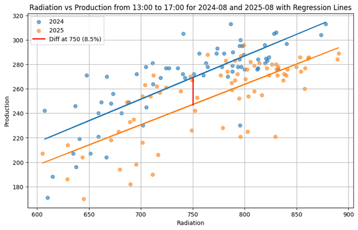
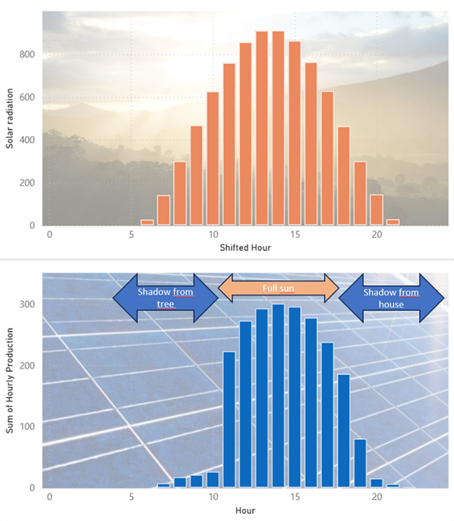

# Solar Panel ROI Study

A data analysis project exploring the **profitability of solar panels** using real production data, consumption, and Copernicus climate datasets.  
This repository uses Python, Power BI, and regression modeling.

---

## Objectives
- Evaluate the **return on investment (ROI)** of solar panels compared to financial benchmarks (€STER rate).
- Assess the **impact of panel degradation** on profitability.
- Build reproducible workflows combining **Python scripts** and **Power BI dashboards**.

---

## Data Sources
- **Consumption data**: from grid provider (Excel, processed in Power Query).
- **Production data**: from Beem solar panel monitoring app.
- **Weather data**: Copernicus Climate Data Store (SSRD values via API, ETL pipeline from raw `.nc` files to Power BI visuals).

---

## Report
 The conclusion is that additional panels are **not** worth buying.  
- [Homepower Study (PDF)](outputs/homepower_public.pdf) : comprehensive report with figures available in the **outputs** directory   
- The main finding is the Year-on-Year production capacity loss depicted here:
    
- A typical display for one day of solar panel production compared to sun radiation:

